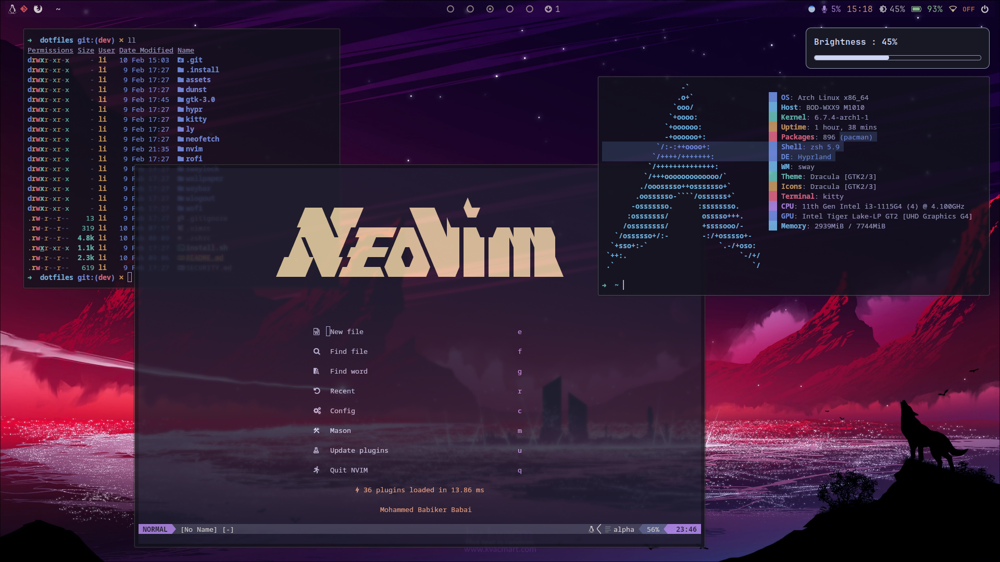

# dotfiles

<!-- > Open For Any Suggestions -->
<!---->
<!-- ## Screenshot -->
<!---->
<!--  -->

#### Installations

```sh
# Install with stow

git clone https://github.com/mohammedbabiker/dotfiles.git ~/.dotfiles
cd dotfiles
stow .
```

#### Credits

- [Stephan Raabe](https://gitlab.com/stephan-raabe/dotfiles)
- [Chris Power](https://github.com/cpow/neovim-for-newbs)
