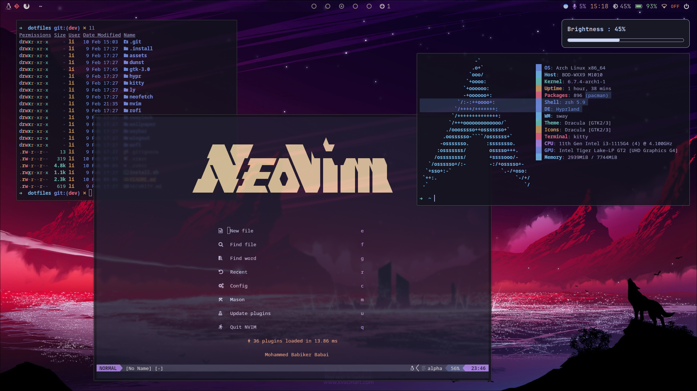

# mohmd-Hyprland-Dotfile

> Open For Any Suggestions

## Screenshot :


## Details :
- **OS**: Arch Linux
- **Compositor**: [Hyprland](https://github.com/hyprwm/Hyprland)
- **Notifications**: [dunst](https://github.com/dunst-project/dunst)
- **Wallpaper Loader**: [hyprpaper](https://github.com/hyprwm/hyprpaper)
- **Terminal**: [kitty](https://github.com/kovidgoyal/kitty)
- **Search menu**: [rofi](https://github.com/davatorium/rofi)
- **Fetch script**: `neofetch`
- **Browser**: Firefox
- **Font**: [Nerd Font](https://www.nerdfonts.com/)

## Dependencies & apps :

```sh
yay --needed -S pacman-contrib hyprland-git bluez bluez-utils unzip rofi dunst \ 
xfce4-power-manager thunar noto-fonts ttf-font-awesome otf-font-awesome \ 
ttf-fira-sans ttf-fira-code ttf-firacode-nerd figlet vlc eza python-pip \
python-psutil python-rich python-click pavucontrol xautolock blueman \
brightnessctl gum xdg-desktop-portal nm-connection-editor gvfs lazygit \
xdg-user-dirs networkmanager network-manager-applet pamixer grim \
rofi-emoji hyprpaper-git swaylock-effects dracula-icons-git\
thunar-archive-plugin xdg-desktop-portal-hyprland-git ffmpegthumbnailer \
qt5-wayland waybar-hyprland-git pfetch bibata-cursor-theme trizen pacseek \
swayidle wlogout wlr-randr
```
## Installations
```sh
git clone https://github.com/mohammedbabiker/mohmd-Hyprland-Dotfile.git
cd mohmd-Hyprland-Dotfile
cp -r ./* ~/.config/
```
## Keybinds
All keybinds can be found in the `hypr/keybindings.conf` config file
- `SUPER+SPACE`: Application Launcher (rofi)
- `SUPER+CTRL+M`: Quit Hyprland
- `SUPER+1,..9`: Switch workspace
- `SUPER+SHIFT+1,..9`: Move window to workspace
- `SUPER+Q`: Kitty
- `SUPER+ALT+X`: Firefox
- `SUPER+E`: Filemanager (thunar)
- `SUPER+PRINT`: Take a Screenshot

## Credits

Inspired by [Stephan Raabe](https://gitlab.com/stephan-raabe/dotfiles), [Roshan Paudel](https://github.com/hyper-dot/Arch-Hyprland), [SolDoesTech](https://github.com/SolDoesTech/hyprland)
